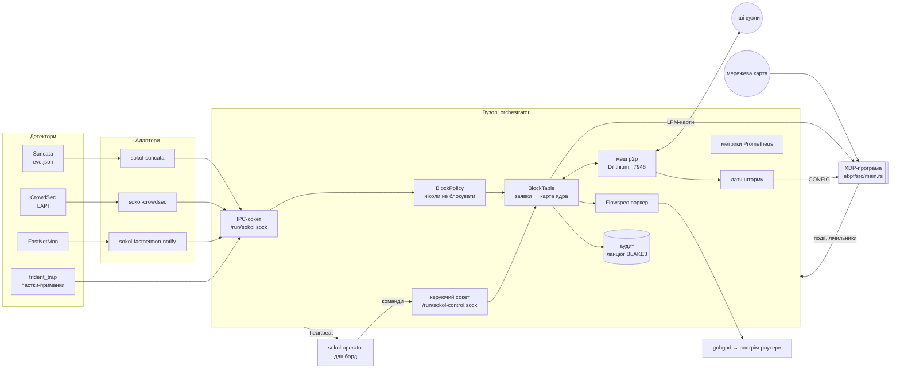
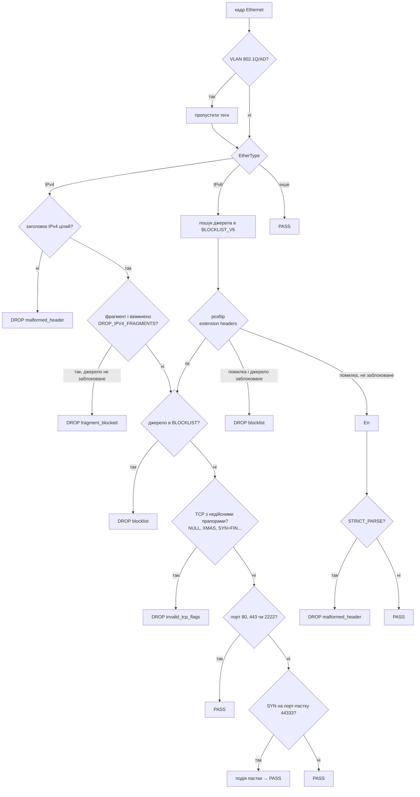
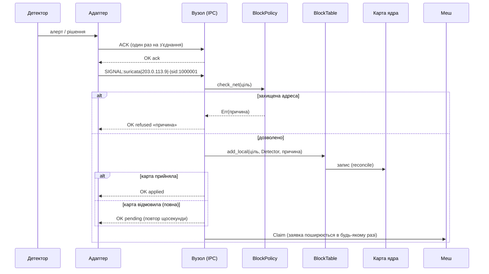
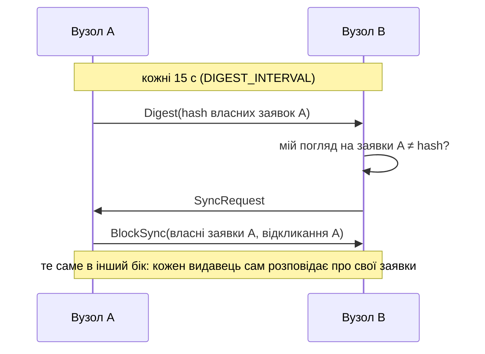
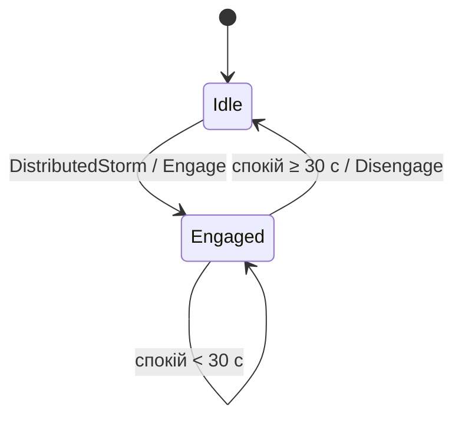

# Архітектура Sokol-Core

Цей документ пояснює, **як влаштований Sokol, чому саме так і як це перевірити**. Кожне важливе
твердження супроводжує посилання на файл або тест, який його доводить. Якщо твердження і код
розходяться, правий код, а документ треба виправити.

> **Стан:** описано систему після PR #18–#24. Усі разом їх перевірено на гілці
> `integration/2026-09-25b`: 123 модульні тести, smoke 103/103, demo, бенчмарки.
> Доки ці PR не злиті, main поводиться інакше в описаних ними місцях: заявки, меш, аудит,
> Flowspec, дашборд, адаптери, суворий режим.

## Зміст

1. [Що таке Sokol і чим він не є](#1-що-таке-sokol-і-чим-він-не-є)
2. [Карта компонентів](#2-карта-компонентів)
3. [Одна ідея, на якій тримаються рішення](#3-одна-ідея-на-якій-тримаються-рішення)
4. [Шлях пакета: XDP](#4-шлях-пакета-xdp)
5. [Шлях рішення: від сигналу до відкинутого пакета](#5-шлях-рішення-від-сигналу-до-відкинутого-пакета)
6. [Модель рішень: заявки з власниками](#6-модель-рішень-заявки-з-власниками)
7. [Меш: довіра, доставка, збіжність](#7-меш-довіра-доставка-збіжність)
8. [Політика «ніколи не блокувати»](#8-політика-ніколи-не-блокувати)
9. [Аудит](#9-аудит)
10. [Оператор: керуючий сокет і дашборд](#10-оператор-керуючий-сокет-і-дашборд)
11. [Детектори й адаптери](#11-детектори-й-адаптери)
12. [BGP Flowspec](#12-bgp-flowspec)
13. [Шторм і суворий режим](#13-шторм-і-суворий-режим)
14. [Відмови й деградація](#14-відмови-й-деградація)
15. [Як це перевіряється](#15-як-це-перевіряється)
16. [Свідомі обмеження й відкриті питання](#16-свідомі-обмеження-й-відкриті-питання)
17. [Словник](#17-словник)

---

## 1. Що таке Sokol і чим він не є

**Sokol — розподілений рівень виконання й довіри для мережевих блокувань.** Він приймає рішення
детекторів (Suricata, CrowdSec, FastNetMon, власні пастки), за мілісекунди виконує їх у ядрі
через XDP і поширює на інші вузли мешу. Під час поширення він перевіряє, *хто* прийняв рішення,
*чи мав на це право* і *чи не зачепить* воно те, що блокувати не можна. Усе фіксується в журналі
аудиту.

Чим Sokol **не** є:

- **Не детектор.** Він не вирішує, що трафік шкідливий. Це роблять Suricata, CrowdSec та інші.
  Власні евристики Sokol (пастки, аномалія швидкості в `orchestrator/src/sokol.rs`) другорядні.
  Крейт `ai/` експериментальний, до рішень про блокування не під'єднаний і тестів не має.
- **Не DDoS-скрубер.** XDP відкидає пакети на мережевій карті, але об'ємну атаку, що забиває
  канал, вузол не зупинить. Для цього є BGP Flowspec (§12): Sokol передає правило відкидання
  апстріму.
- **Не шифрує меш сам.** Меш автентифікує повідомлення (Dilithium), але не приховує їх;
  конфіденційність дає WireGuard (§7.6).

## 2. Карта компонентів



| Частина | Де | Роль |
|---|---|---|
| XDP-програма | `ebpf/src/main.rs` | вирішує долю кожного пакета: відкинути чи пропустити |
| Спільні типи | `common/src/lib.rs` | причини відкидання, прапори `CONFIG`, місткість карт, ознаки недійсних TCP-прапорів |
| Журнал аудиту | `common/src/audit_log.rs` | ланцюг записів тільки на дописування, обертання сегментів, перевірка |
| Оркестратор | `orchestrator/src/main.rs` | збирає все докупи: сокети, тік, меш, метрики |
| Заявки й карта | `orchestrator/src/block_table.rs` | модель рішень (§6) і узгодження з картою ядра |
| Політика захисту | `orchestrator/src/block_policy.rs` | що блокувати не можна (§8) |
| Меш | `orchestrator/src/p2p.rs`, `mesh_sync.rs` | транспорт, довіра, протокол (§7) |
| Кластер | `orchestrator/src/cluster_state.rs` | телеметрія вузлів, статус, латч шторму |
| Режим оборони | `orchestrator/src/defense.rs` | суворий режим XDP на час шторму (§13) |
| Flowspec | `orchestrator/src/flowspec.rs` | правила відкидання в апстрімі (§12) |
| Сигнали, атаки | `orchestrator/src/signal.rs`, `attack_reports.rs` | розбір `SIGNAL:` і `ATTACK:` |
| Керування | `orchestrator/src/control.rs` | команди оператора (§10) |
| Доставка | `orchestrator/src/delivery.rs` | черга з підтвердженням для адаптерів (§11) |
| Метрики | `orchestrator/src/metrics.rs` | текстовий формат Prometheus |
| Бінарники | `orchestrator/src/bin/` | адаптери, дашборд, пастка, `monitor`, `sokol-client` |

## 3. Одна ідея, на якій тримаються рішення

Майже всі дефекти, знайдені в Sokol (власними замірами, формальними моделями stargate і рев'ю
Codex), мали **одну форму**:

> **Рішення читало *якийсь* запис — останній, локальну копію, пам'ять процесу — замість
> встановленого факту.**

| Де траплялось | Що читалось | Що мало читатись | Виправлення |
|---|---|---|---|
| `UnblockIp` з мешу | «адреса заблокована» | *хто* її заблокував | заявки з власниками (§6) |
| BlockSync після розбану оператором | «зараз не заблоковано» | «оператор зняв *саме цю* заявку» | відкликання за id (§6.4) |
| BlockSync у повну карту | облік у пам'яті | що справді в карті ядра | бажане ≠ застосоване (§5.3) |
| Flowspec після краху | «що я колись анонсував» | що справді в RIB gobgpd | звірка зі спостереженим (§12) |
| Дашборд | власний список банів | бани на вузлі | `LIST_BANS` (§10) |
| Аудит пастки | «блок поставлено» | результат вставки | `Enforcement` (§5) |

Звідси три правила, які проходять через увесь код:

1. **Факт має власника й ідентичність.** Рішення — незмінна заявка з видавцем і хешем.
   Скасувати можна лише конкретну заявку, і лише тому, хто має на це право.
2. **Бажане й застосоване живуть окремо.** Лічильники й відповіді показують те, що справді
   сталося в ядрі чи в апстрімі, а не те, що мало статися.
3. **Невідоме — це невідоме.** Якщо результат неясний (таймаут, недоступний диск, втрачена
   відповідь), система не звітує успіх. Вона перечитує стан, повторює спробу або явно
   позначає деградацію.

## 4. Шлях пакета: XDP

Програма `sentinel_vfr_filter` (`ebpf/src/main.rs`) працює на інтерфейсі `--interface` у режимі
`--xdp-mode auto|native|generic`.



**Чому так:**

- **Блок джерела важливіший за помилку розбору** (ADR-6). Раніше обрізаний IPv6 extension header
  повертав `Err`, а точка входу перетворювала його на `XDP_PASS` ще до перевірки блоку. Тепер
  `drop = blocked(src) ∨ (розібрано ∧ φ)`: помилка розбору не може *зменшити* множину
  відкинутого для заблокованих джерел. Перевірка: smoke «blocked IPv6 source with a truncated
  extension header is dropped».
- **Нерозібрані пакети від незаблокованих джерел пропускаються** (fail-open). XDP не валідатор
  протоколів, і сміття відкине ядро. Відкидати їх завжди означало б ламати легітимний, але
  екзотичний трафік. Виняток — суворий режим під час шторму (§13).
- **Обрізаний IPv4-заголовок відкидається завжди.** Це старіша поведінка, і вона лишилась: без
  цілого заголовка немає джерела, отже нема що перевіряти.
- **Порти 80/443/2222 пропускаються явно**, щоб правила пастки не зачепили веб і
  адміністративний SSH (2222). Цей порт `trident_trap` відмовляється слухати.

**Карти eBPF:**

| Карта | Тип | Хто пише | Призначення |
|---|---|---|---|
| `BLOCKLIST_V4`, `BLOCKLIST_V6` | LPM-трі, 65 536 записів (`common::BLOCKLIST_CAPACITY`) | `BlockTable` | заблоковані адреси й префікси |
| `STATS` | PerCpuArray | XDP | лічильники пакетів, відкидань за причинами, пригнічених подій |
| `CONFIG` | Array[1] | `defense.rs` | прапори `DROP_IPV4_FRAGMENTS`, `STRICT_PARSE` |
| `EVENTS` | RingBuf 256 КіБ | XDP | вибіркові події відкидання й пастки |

**Події обмежені:** відкидання потрапляють у кільцевий буфер з вибіркою 1 з 256 і в межах
бюджету 64 події на секунду на CPU (`MAX_EVENTS_PER_CPU_PER_SEC`). Інакше флуд перетворився б на
флуд записів аудиту. Пригнічені події рахуються в `sokol_xdp_events_suppressed_total`. Перевірка:
smoke «trap events recorded … suppressed».

## 5. Шлях рішення: від сигналу до відкинутого пакета



### 5.1 IPC-сокет (`--ipc-socket`, типово `/run/sokol.sock`)

Права `0600`, або `0660` з групою `--ipc-group`: хто може писати сюди, той може блокувати.
Одна команда на рядок, до 4096 байтів (`MAX_IPC_LINE`):

| Команда | Що робить |
|---|---|
| `DROP_IMMEDIATE:<адреса або префікс>` | локальне рішення детектора (пастки) |
| `SIGNAL:<джерело>\|<src>\|<dst або ->\|<причина>` | рішення зовнішнього детектора. Якщо `src` — це сам вузол (алерт на власний вихідний трафік), блокується `dst` (`signal.rs`) |
| `ATTACK:<джерело>\|<жертва>\|<напрям>\|<pps>\|<ban\|unban>` | FastNetMon: вузол *під атакою*. Жертву не блокують, бо це власна адреса (`attack_reports.rs`) |
| `DB_LOG:<текст>` | запис у журнал аудиту |
| `ACK` | з цього моменту вузол відповідає на кожну команду (§11) |

Ліміти (F11): не більше 64 одночасних з'єднань, з'єднання, що простоює 300 с, закривається.

### 5.2 Результат виконання

`enforce_block_local` повертає `Enforcement::{Enforced, Refused, Pending}`, і аудит пише саме
його. Раніше пастка записувала `Action:EnforcedDrop` навіть після відмови для захищеної адреси.
Перевірка: smoke «a trap hit from a protected address is audited as refused, not enforced».

### 5.3 Бажане проти застосованого

`BlockTable` зберігає **бажаний** стан (дійсні заявки) окремо від **застосованого** (що є в
карті ядра) і приводить їх у відповідність по кожній цілі (`reconcile`). Запис чи видалення,
що не вдалися, лишаються в черзі очікування й повторюються на кожному тіку (до 256 за тік, щоб
повна карта не коштувала тисячі системних викликів щосекунди). Метрика `sokol_blocks_active`
рахує лише застосоване, `sokol_blocks_pending` — те, що чекає.

Чому так: раніше BlockSync спершу записував облік, а потім карту. При повній карті вузол
показував 65 537 блоків при місткості 65 536, а трафік проходив. Перевірка: тести
`a_block_the_map_cannot_take_is_pending_not_counted_and_retried`,
`a_failed_removal_is_not_reported_and_is_retried` (`block_table.rs`) і пакетний свідок у
`bench/local.sh fill`.

## 6. Модель рішень: заявки з власниками

### 6.1 Заявка

Кожне рішення про блок — **заявка** (`Claim`, `block_table.rs`): незмінний запис

```text
issuer (вузол) · kind · target (канонічний) · issued_ms · expires_ms · reason
```

Її ідентичність — BLAKE3 від її байтів (`Claim::id`). Два рішення про ту саму адресу є двома
різними заявками. Адреса відкидається, поки діє **хоча б одна** заявка на неї.

| Вид | Хто створює | Закінчується | Хто знімає | Йде в меш |
|---|---|---|---|---|
| `Static` | `--block` | ніколи | лише конфігурація (`UNBAN_IP` відмовляє) | ні |
| `Operator` | `BAN_IP` | ніколи | оператор (`UNBAN_IP`, `FLUSH_ALL`) | ні |
| `Detector` | пастки, IPC, `SIGNAL`, адаптери, пір | так | видавець; локальний оператор | так |

### 6.2 Термін дії

Власна заявка детектора діє `--block-ttl` (900 с). Кожен повтор протягом 24 годин подвоює
термін, до `--block-ttl-max` (86 400 с); `--block-ttl 0` робить заявки безстроковими. Кожен
повтор — окрема заявка, тому коротший повтор не може обірвати довший блок. Заявка піра зберігає
власний `expires_ms`, але тут діє не довше за `--block-ttl-max` і конверт піра (§7.5).
Перевірка: `detector_blocks_escalate_and_are_capped`,
`expiry_unblocks_once_and_a_shorter_repeat_does_not_cut_a_longer_block`.

### 6.3 Хто може зняти чужий блок (ADR-1)

Частковий порядок повноважень: `static-config > operator > {локальний детектор, пір}`. Детектор
і пір непорівнянні, тому жоден не знімає заявок іншого.

- **Через меш відкликати заявку може лише її видавець.** Транспорт перевіряє, що поле `issuer`
  дорівнює автентифікованому відправнику (`MeshCommand::claimed_sender`, `p2p.rs`).
- Раніше будь-який закріплений пір міг командою `UnblockIp` зняти на всіх вузлах блоки їхніх
  *власних* детекторів.
- Відкликачі зберігаються множиною: чуже «відкликання» не може витіснити відкликання
  видавця, навіть якщо прийшло раніше за саму заявку.

Перевірка: `a_peer_cannot_retract_another_nodes_claim`,
`another_nodes_retraction_cannot_displace_the_issuers`,
`a_peer_cannot_send_claims_in_another_nodes_name`. Формальна модель: `adr1-authority-*`
(§15.4).

### 6.4 Розбан оператором проти копій пірів (ADR-2)

`UNBAN_IP` і `FLUSH_*` знімають **заявки, що діють у цей момент, за їхніми id**. Зняття
записується на диск.

- Копія знятої заявки від піра її не поверне, скільки б вона не жила і скільки б разів меш не
  перепідключався.
- Нове виявлення — це нова заявка, і воно блокує знову.
- Зняття власних заявок детектора поширюється на весь меш; зняття чужих діє лише локально.

Чому не за часом: попереднє виправлення (#11) тримало розбан `--block-ttl-max` секунд. Модель
показала, що це правильно **лише** за однакового `--block-ttl-max` на всіх вузлах; модель з
різними максимумами спростовується за 4 кроки. Перевірка:
`an_operator_lift_holds_against_every_copy_of_the_lifted_claims` (7 днів, щодня з перезапуском),
`decisions_and_lifts_survive_a_restart`.

### 6.5 Збереження (ADR-4)

Власні заявки вузла і зняття оператора записуються атомарно (тимчасовий файл → `rename`,
`0600`) у `--state-file` (типово `<db-path>.blocks.json`). При старті вони відновлюються й
повторно перевіряються політикою «ніколи не блокувати», бо вона могла змінитися. Заявки пірів
повертаються через меш. Раніше операторський бан зникав після перезапуску. Перевірка: smoke
«an operator ban survives a restart».

## 7. Меш: довіра, доставка, збіжність

### 7.1 Довіра

- **Закріплені ключі.** Вузол чує лише пірів, чий ML-DSA/Dilithium3-ключ є в `--peers-file`.
  Ротація: `public_keys: [старий, новий]`, `RELOAD_PEERS`. Зіпсований файл відхиляється, і
  попередня довіра лишається.
- **Конверт.** Підпис покриває домен, відправника, час, nonce і корисне навантаження.
  Конверти поза вікном ±30 с (`MAX_CLOCK_SKEW_MS`) і повтори (`ReplayGuard`) відкидаються.
- **Прив'язка з'єднання.** Перше повідомлення має бути рукостисканням. Після нього з'єднання
  говорить лише від імені того, хто в ньому назвався.
- **Хто за кого говорить.** Телеметрія, заявки, відкликання і дайджести мусять описувати
  відправника. `LocalDetection`, `EngageDefense` і `DisengageDefense` з мережі не приймаються
  взагалі: режим оборони вмикає лише власний латч вузла.

Перевірка (`p2p.rs`): `stranger_key_is_rejected_even_with_valid_signature`,
`header_fields_are_covered_by_the_signature`, `replay_and_stale_envelopes_are_rejected`,
`connection_is_bound_to_its_handshake_identity`, `a_peer_cannot_switch_this_nodes_defense_mode`,
`rotation_accepts_old_and_new_keys_then_revokes_the_old_one`.

### 7.2 Протокол (`mesh_sync.rs`)

| Повідомлення | Зміст | Хто може надіслати |
|---|---|---|
| `Claim` | заявка детектора | лише її видавець |
| `Retract` | id власних заявок | лише їх видавець |
| `BlockSync` | **власні** заявки відправника і його власні відкликання | будь-хто, `issuer` = відправник; кожна вкладена заявка теж мусить мати `issuer` = відправник, інакше з'єднання рветься |
| `Digest` | хеш **власних** заявок відправника | будь-хто, `issuer` = відправник |
| `SyncRequest` | «надішли мені свої заявки» | будь-хто, `issuer` = відправник |
| `Telemetry` | навантаження відправника | лише про себе |

> Зміна протоколу в #15 несумісна: усі вузли мешу оновлюються разом. Узгодження версій
> поки немає.

### 7.3 Стан мешу як решітка (ADR-3)

Стан вузла — дві множини, які тільки ростуть: заявки `C` і відкликання `R`. Злиття — їх
об'єднання. Такий стан має дві ключові властивості:

- **Втрата, дублікати й перестановка повідомлень безпечні.** Злиття ідемпотентне,
  комутативне й асоціативне. Вичерпна перевірка цього — `lattice_check.py`, §15.4.
- **«Доставлено»** означає «стан піра ≥ мій», а не «повідомлення потрапило в сокет».



Чому так: раніше `broadcast` робив `try_send`. Коли черга піра переповнювалась, блок губився, і
ніщо його не відновлювало, поки з'єднання жило (F05). Живий замір на каналі 2 Мбіт/с: вузол 2
застряг на 265 з 20 000 блоків і стояв так понад 60 с. З дайджестами він зійшовся менш ніж за
10 с без перепідключення. Зауважте: заморожений пір — це **не** F05. Записувач має таймаут,
з'єднання рветься, і BlockSync при перепідключенні вже відновлював стан.

**Кожен вузол говорить лише за себе (R26-01).** Спершу знімок ніс *усі* заявки, які знав
відправник, тобто й чужі. Але заявка не підписана своїм видавцем, тож один закріплений пір міг
вкласти в знімок заявки «від» вигаданих вузлів і сам набрати кворум (§7.5). Рев'ю Codex
відтворило це через справжній TCP-слухач. Тепер:
- знімок і дайджест охоплюють лише власні заявки відправника;
- транспорт рве з'єднання, якщо у знімку є чужа заявка;
- про чужі заявки вузол дізнається тільки від їхнього видавця.

Звідси вимога **повного мешу** (кожен вузол з'єднаний з кожним), яку README вже ставив. Заявки
вузла, прибраного з peers-файлу, перестають діяти одразу після `RELOAD_PEERS` (причина
`revoked`), як і заявки невідомого походження. Перевірка: `a_snapshot_with_claims_of_other_nodes_is_refused`
(`p2p.rs`, сто вигаданих видавців), `a_snapshot_carries_only_the_nodes_own_claims`,
`a_revoked_origin_stops_counting`.

Заявки, яких вузол не застосовує (захищена ціль, поза конвертом, без кворуму), він **усе одно
знає**, і вони входять у його погляд на заявки видавця. Інакше дайджести ніколи б не зійшлися.
Перевірка: `protected_targets_are_known_and_shared_but_not_enforced`,
`envelopes_do_not_change_the_shared_mesh_state`, `one_exchange_with_each_issuer_converges_including_retractions`.

**Межі:**
- відомих заявок і записів про відкликання не більше `4 × 65 536`;
- запис про відкликання забувається, коли минає `expires_ms` його заявки. Для ще не баченої
  заявки — через `--block-ttl-max`. «Назавжди» лишаються лише відкликання безстрокових
  заявок (R26-03);
- причина в заявці обмежена 512 байтами;
- знімок пакується за бюджетом у 112 КіБ JSON на повідомлення, для заявок і відкликань разом,
  тож кожна запечатана рамка вміщується в ліміт транспорту 128 КіБ. Тест перевіряє справжні
  рамки для 3000 заявок із максимальною причиною і 3000 відкликань (R26-02).

### 7.4 Транспорт

- **З'єднання:** порт 7946 (8080 зайнятий CrowdSec LAPI); кадри до 128 КіБ; один запис на кадр
  і `TCP_NODELAY` (Nagle потроював затримку).
- **Живучість:** heartbeat Ping/Pong, таймаут читання 30 с; повторне підключення до
  seed-вузлів з паузою від 1 с до 30 с.
- **Реєстр пірів:** ідентифікатор кожного з'єднання не дає старому з'єднанню прибрати нове.
- **Розсилка неблокувальна**, тож повільний пір не зупиняє вузол; пропущене відновлюють
  дайджести.

Перевірка: `seed_connection_is_retried_until_the_peer_comes_up`,
`a_stale_connection_cannot_unregister_its_replacement`, `broadcast_does_not_wait_for_a_stuck_peer`.

### 7.5 Межі повноважень піра (ADR-7)

- **Кворум.** Заявка піра на префікс ширший за `/24` (IPv4) чи `/64` (IPv6) діє, лише коли той
  самий префікс заявили `--quorum` різних вузлів (типово 2; власна заявка вузла теж
  рахується). Один пір, що повторює заявку, лишається одним вузлом.
- **Конверт.** Одночасно діє не більше `--peer-max-active` заявок піра (16 384), кожна не
  довше `--peer-max-ttl`, рахуючи від моменту, коли вона почала діяти. Решта чекає в черзі
  на вільний слот.
- **Налаштування на піра** в peers-файлі: `"envelope": {"max_active", "max_ttl_secs",
  "min_prefix_v4", "min_prefix_v6"}`. Невідомі поля відхиляються, щоб друкарська помилка не
  вимкнула обмеження мовчки.
- Утримані заявки пишуться в аудит як `MESH_BLOCK_HELD|…|Why:quorum|quota|envelope`.

Чому: інакше один скомпрометований вузол міг заповнити карти всіх вузлів або відрізати цілі
мережі. Кворум потрібен лише для широких префіксів, щоб хост-блоки й далі поширювались за
мілісекунди. Перевірка: `a_wide_prefix_from_one_peer_waits_for_a_second_node`,
`a_peers_envelope_bounds_what_it_can_block_here`, smoke «quorum: node 1 holds node 2's /20».

### 7.6 Конфіденційність: WireGuard

Меш підписує, але не шифрує. Для конфіденційності його запускають усередині WireGuard
(`deploy/wireguard-mesh.conf.example`), а P2P-слухача прив'язують до тунельної адреси.

Важливо: **XDP бачить тунель ззовні**, тобто зовнішню адресу `Endpoint` піра. Тому в
`--never-block` треба додати обидві адреси кожного піра, тунельну і зовнішню. Інакше блок
зовнішньої адреси обриває тунель, а з ним і меш. Перевірка: smoke «node 2's WireGuard endpoint
… is protected».

### 7.7 Телеметрія кластера

Кожні 5 с вузол розсилає підписаний звіт: пакети й відкидання за секунду, кількість активних
блоків і чи він під атакою (`--attack-drops-per-sec` або звіт FastNetMon). Вузли, що мовчать
15 с, випадають із картини. Статус кластера й латч шторму описано в §13.

## 8. Політика «ніколи не блокувати»

`BlockPolicy` (`block_policy.rs`) захищає від блокування, хоч би хто його просив:

- петлю, unspecified, broadcast, multicast і IPv6 link-local;
- **власні адреси вузла** (`getifaddrs`) і **шлюзи** (`/proc/net/route`);
- seed-пірів і `--never-block`.

Префікс відхиляється, якщо він ширший за `--min-block-prefix-v4` (/16) чи `--min-block-prefix-v6`
(/48), або якщо перетинається із захищеною адресою *в будь-який бік*: містить її або лежить
усередині захищеного діапазону.

Чому: автоматика, що відрізала сам вузол, його шлюз чи мережу оператора, гірша за пропущену
атаку. Перевірка: `prefixes_must_not_cover_protected_addresses_or_be_too_wide`,
`parses_default_gateways_from_proc`, demo крок 4.

> Знімок захисту будується при старті. Адреси, що з'являться пізніше (новий інтерфейс чи
> шлюз), до перезапуску не захищені (§16).

## 9. Аудит

`common/src/audit_log.rs`: записи SAL2 утворюють ланцюг BLAKE3 (кожен запис хешує попередній).

- **Сегменти.** Файл обертається при `--audit-max-bytes` (100 МіБ), зберігається `--audit-keep`
  сегментів (10). Кожен сегмент починається там, де закінчився попередній.
- **Перевірка.** `monitor --verify` перевіряє весь ланцюг; `monitor --dump` виводить записи.
- **Обірваний хвіст.** Після краху обірваний хвіст відрізається при відкритті. Зіпсований
  запис у середині не дає відкрити лог, і файл лишається неторканим.

**Міцність (ADR-5):**

- запис синхронізується (fsync) не пізніше ніж за 100 мс після останньої *успішної*
  синхронізації, або після 64 записів, хоч би як рівно йшли події;
- лог має одного писача: ексклюзивний замок на `<db-path>.lock`, другий процес отримує помилку;
- невдалий запис обрізається до останнього цілого запису. Якщо і це не вдалося, лог стає
  «зіпсованим» і нових записів не приймає до перевідкриття.

**Деградація замість мовчання:** якщо лог не пишеться (диск повний, помилка вводу-виводу),
**блокування триває**. Аудит ніколи не зупиняє захист, бо інакше атакер, заповнивши диск,
вимкнув би оборону. Натомість вузол:

- переходить у стан `DEGRADED` (`sokol_audit_healthy 0`, `MODE=DEGRADED` у heartbeat);
- рахує помилки й утрачені записи;
- перевідкриває лог, доки той знову не запишеться;
- після відновлення дописує `AUDIT_LOST|Records:<n>`, тож прогалину видно в самому ланцюгу.

Перевірка: `a_steady_stream_is_fsynced_within_the_interval`, `a_second_node_cannot_open_the_same_audit_log`,
`a_failed_write_that_cannot_be_undone_poisons_the_writer`, живий сценарій «диск аудиту повний»
(§15.3).

**Чого ланцюг не доводить:** той, хто має доступ на запис, може переписати ланцюг цілком.
Щоб це виявити, голову ланцюга (друкує `monitor --verify`) треба зберігати там, куди вузол
писати не може.

## 10. Оператор: керуючий сокет і дашборд

**Керуючий сокет** (`--control-socket`, `0600` або `0660` з `--control-group`) відокремлений від
IPC: пастка розбирає трафік атакера і не повинна мати змоги знімати бани. Не більше 16 з'єднань;
з'єднання, що простоює 60 с, закривається.

| Команда | Відповідь / дія |
|---|---|
| `BAN_IP:<ціль>` | операторська заявка; захищені цілі відхиляються |
| `UNBAN_IP:<ціль>` | знімає заявки на ціль, крім `--block` |
| `FLUSH_BANS` | знімає заявки детекторів |
| `FLUSH_ALL` | знімає операторські бани і заявки детекторів; `--block` лишається |
| `LIST_BANS` | `OK <усього> <ціль>…` (до 4096 у відповіді) |
| `RELOAD_PEERS` | перечитує peers-файл і конверти |

**Дашборд** (`sokol-operator`, токен на кожен API-запит, cookie `HttpOnly` і `SameSite=Strict`):

- **Джерело істини — вузол.** Список банів дашборд читає з вузла (`LIST_BANS` кожні 5 с і після
  кожної дії). Flush — це одна команда `FLUSH_ALL`. Раніше дашборд тримав власну копію, яка
  губилась після його перезапуску, тож Flush не знімав банів, зроблених не через нього (F08).
- **Вузол, що мовчить 15 с, показується як `STALE`.**
- **Ідентичність (F11).**
  - Телеметрію дашборд приймає лише від uid із `SOKOL_NODE_UIDS` (типово root і власний uid),
    сокет `0660`.
  - Вузол прив'язується до uid свого першого heartbeat.
  - Команди йдуть на керуючий сокет лише тоді, коли `SO_PEERCRED` показує, що його обслуговує
    той самий uid.

  Раніше будь-який локальний процес міг через поле `CTL=` перенаправити бани оператора на
  власний сокет і відповісти «OK».

Перевірка (`sokol-operator.rs`): `a_node_is_bound_to_the_uid_that_announced_it`,
`the_ban_list_is_read_from_the_node`, `a_silent_node_is_shown_stale`,
`telemetry_split_across_writes_is_read_whole`; smoke «a restarted dashboard shows a ban it never made».

## 11. Детектори й адаптери

| Адаптер | Джерело | Що надсилає |
|---|---|---|
| `sokol-suricata` | `eve.json` (стежить за ротацією й обірваними рядками) | `SIGNAL:suricata\|src\|dst\|sid:<id> <сигнатура>` з фільтром за важкістю, дедуплікацією й лімітом частоти |
| `sokol-crowdsec` | потік рішень LAPI | `SIGNAL:crowdsec\|…` лише для локальних походжень (`crowdsec`, `cscli`); діапазони йдуть як префікси |
| `sokol-fastnetmon-notify` | notify-скрипт FastNetMon | `ATTACK:fastnetmon\|жертва\|…`: вузол «під атакою», **без блоку** |
| `trident_trap` | порти-приманки (22, 80, 443, 3306, 6379, 8443) | `SIGNAL:trident\|…` |

**Доставка з підтвердженням (F09, `delivery.rs`):**

- адаптер відкриває з'єднання командою `ACK`, і вузол відповідає на кожен сигнал;
- сигнал лишає обмежену чергу (10k у Suricata, 100k у CrowdSec) **лише після відповіді**;
- помилка транспорту лишає сигнал у черзі й повторює спробу з паузою від 0,5 с до 10 с;
- `refused` і `ERR` остаточні й не повторюються.

Раніше рішення CrowdSec, прийняте, поки вузол лежав, губилось назавжди. Перевірка: тести
`delivery.rs`, smoke «a decision made while the node was down is enforced once it is back».

Межа: черга живе в пам'яті адаптера. Якщо сигнал дійшов, а відповідь загубилась, він може
прийти двічі, і вузол зарахує зайвий «страйк».

## 12. BGP Flowspec

З `--flowspec-gobgp` кожен активний блок анонсується як правило RFC 8955 `match source … then
discard` через локальний gobgpd. Так роутери апстріму відкидають трафік ще до каналу вузла.

- **Звірка зі спостереженим.** Кожне правило вузла має community власника (`--flowspec-community`,
  типово `64512:<node-id>`). Щосекунди окремий воркер читає RIB gobgpd (`gobgp … rib -j`) і
  зрівнює свої правила з активними блоками, до 64 змін за прохід.
  - Правила, лишені запуском, що впав, відкликає наступний запуск.
  - Правила, які втратив gobgpd після перезапуску, анонсуються знову.
- **Чужі правила не чіпаються ніколи**: ні без community, ні отримані від сусіда.
- **Невідомий результат.** Виклик `gobgp`, що завис, убивається через `kill_on_drop`, а його
  результат з'ясовується наступним читанням RIB.
- **Окремий воркер** не затримує тік: закінчення блоків, метрики й завершення роботи від нього
  не залежать.

Перевірка (`flowspec.rs`): `only_local_rules_with_our_community_and_a_single_source_are_ours`
(JSON справжнього gobgpd 4.9.0), `a_timed_out_call_is_killed`; smoke «the next run withdraws the
crashed run's stale rule».

## 13. Шторм і суворий режим



**Статус кластера** (`cluster_state.rs`):

- `Stable` — немає вузлів під атакою;
- `LocalIncident` — частка вузлів під атакою ≤ `--storm-threshold` (0,5);
- `DistributedStorm` — частка більша за поріг.

Латч вмикається одразу й вимикається лише після 30 с спокою, тож шторм, що мерехтить, — це одна
подія. Перевірка: `latch_follows_the_transition_table`,
`engage_and_disengage_strictly_alternate_for_any_input`.

**Суворий режим (ADR-6, `defense.rs`).** Поки латч увімкнено, `--storm-mode strict` (типово)
вмикає `STRICT_PARSE` і `DROP_IPV4_FRAGMENTS`: нерозібрані заголовки й фрагменти відкидаються.
Після шторму повертаються **рівно ті прапори, які задав оператор**. `--storm-mode observe` лише
записує шторм у лог. Метрика `sokol_defense_strict`, аудит `DEFENSE_MODE|Strict/Normal`.
Перевірка: `disengaging_keeps_the_operators_flags`; smoke «unparsable headers from an unblocked
source are dropped in strict mode» і «pass to the stack again» після шторму.

## 14. Відмови й деградація

| Відмова | Поведінка | Де видно |
|---|---|---|
| Карта ядра повна | заявка записана, запис у карту чекає й повторюється | `sokol_blocks_pending`, `BLOCK_PENDING`, `OK pending` |
| Видалення з карти не вдалося | ціль і далі вважається заблокованою, видалення повторюється | `sokol_blocks_pending` |
| Диск аудиту повний або помилка запису | блокування триває, лог перевідкривається | `sokol_audit_healthy 0`, `MODE=DEGRADED`, `AUDIT_LOST` |
| Пір недоступний / черга переповнена | розсилка не блокується, стан відновлюють дайджести | лог «State differs», `MESH_BLOCK_*` |
| Розрив мешу | вузли працюють автономно, після з'єднання BlockSync і дайджести | `sokol_p2p_active_peers` |
| Вузол недоступний для адаптера | сигнали чекають у черзі адаптера | лог адаптера «queued, retrying» |
| gobgpd недоступний чи повільний | воркер повторює спробу; головний цикл не чекає | лог `[Flowspec]`, `sokol_flowspec_announced` |
| Зіпсований peers-файл | відхиляється, діє попередня довіра | відповідь `RELOAD_PEERS` |
| Скомпрометований пір | лише хост-блоки в межах його конверту; широкі — з кворумом; знімати чужі заявки не може | `MESH_BLOCK_HELD` |
| Шторм | суворий режим XDP до 30 с спокою | `sokol_defense_strict` |

## 15. Як це перевіряється

### 15.1 Модульні тести

```bash
cargo test --workspace --locked
```

Тести названо твердженнями, яких вони дотримуються, наприклад
`an_operator_lift_holds_against_every_copy_of_the_lifted_claims`. Карти ядра в тестах
`BlockTable` заміняє `FakeLists` зі скінченною місткістю й відмовами, які можна вмикати
(трейт `Blocklist`), тож обидві відмови ядра перевіряються без ядра.

### 15.2 Живий smoke

```bash
sudo scripts/xdp-smoke.sh target/release/orchestrator
```

Близько сотні перевірок на справжньому XDP у netns:

- два вузли мешу через WireGuard;
- пара gobgpd для Flowspec;
- справжні Suricata, CrowdSec і FastNetMon;
- перезапуски, запуск без root з мінімальними capabilities, обертання аудиту.

Запускається в CI разом із `demo/demo.sh`: три вузли, п'ять кроків від сканування до
закінчення блоків.

### 15.3 Заміри

- `bench/local.sh latency`: від сигналу до початку відкидання. Верхня межа береться з номерів
  запитів, а паралельний контрольний пінг відсіює раунди з випадковими втратами. На тестовому
  хості це 1–2 мс.
- `bench/local.sh fill`: 65 536 блоків із постумовами і пакетним свідком. Якщо постумова не
  досягнута, скрипт завершується з кодом 1, а не друкує успіх.
- `bench/mesh.sh`: поширення в мешу з N вузлів і розрив мережі.

### 15.4 Практика перевірки

- **Червоне перед зеленим.** Кожне виправлення має тест, який на старому коді падає *саме на
  своїй перевірці*, а не, наприклад, на помилці імпорту.
- **Мутації.** Виправлення навмисно ламають і дивляться, чи тест це ловить. Кілька тестів
  спершу мутацію не ловили, і їх посилили. Це описано в описах PR.
- **Контроль поруч із вимірюванням.** Перевірка «відкинуто в суворому режимі» має парну
  «проходить у звичайному». Саме контроль показав, що перший подразник для суворого режиму
  нічого не доводив, бо обрізаний IPv4 відкидається в будь-якому режимі.
- **Формальні моделі.** Правила повноважень, розбану й кворуму змодельовано як малі автомати й
  перевірено stargate. Закони решітки стану мешу перевірено вичерпно (`lattice_check.py`).
  Моделі й живі сценарії лежать у `experiments/` приватного репозиторію `s0fractal/sokol`.
  Модель — не код: відповідність тримають тести.

## 16. Свідомі обмеження й відкриті питання

- **Жвавість не доведена.** Що обмін дайджестами колись відбудеться, перевіряє тест, а не
  доведення.
- **Годинники.** `expires_ms` абсолютний, тож годинники вузлів мають бути узгоджені. Вікно
  конвертів ±30 с — теж частина контракту.
- **Версії протоколу.** Узгодження версій мешу немає, тож оновлювати треба весь меш одразу.
- **Захист від самоблокування — знімок при старті.** Нові адреси й шлюзи до перезапуску не
  захищені. Зовнішні адреси WireGuard треба вказати вручну; автоматичний захист через netlink
  ще не зроблено.
- **Черга адаптера в пам'яті.** Після перезапуску адаптера Suricata черга губиться.
- **Відтворюваність збірки.** CI закріплює версії не всіх інструментів (nightly, архіви
  bpf-linker і GoBGP без перевірки хешу). Матриці ядер і fuzz-цілей немає.
- **Нестабільність у CI.** Перевірки Flowspec у smoke раз поводились нестабільно (сесія
  встановлена, маршрути не ходили). Smoke тепер друкує стан обох gobgpd, якщо таке повториться.
- **`ai/` і `sokol-client`** — експериментальні й поза основним шляхом рішень. `sokol-client`
  підключає власну XDP-програму, тож на інтерфейсі оркестратора його не запускають.

## 17. Словник

| Термін | Значення |
|---|---|
| **Заявка** (claim) | незмінне рішення про блок з видавцем; ідентичність — хеш байтів |
| **Відкликання** (retraction) | видавець бере назад свою заявку за id |
| **Зняття** (lift) | оператор локально знімає заявки за id; для власних заявок детектора це ще й відкликання |
| **Бажане / застосоване** | дійсні заявки / записи в карті ядра |
| **Дайджест** | хеш множини заявок, що поширюються; основа анти-ентропії |
| **Конверт** (envelope) | 1) підписане повідомлення мешу; 2) межі того, що пір може нав'язати вузлу (§7.5), залежно від контексту |
| **Кворум** | скільки різних вузлів мають заявити широкий префікс |
| **Латч шторму** | перемикач «розподілений шторм», що вимикається лише після 30 с спокою |
| **DEGRADED** | вузол блокує, але аудит не пишеться; стан видно в метриках і heartbeat |
| **ADR-n** | архітектурні рішення з обґрунтуванням і доказами (приватний документ `08-adr-semantyka.md`) |
