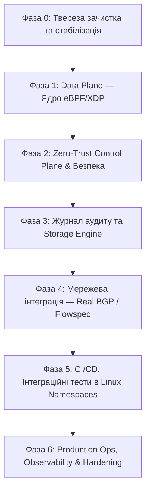

# Sokol-Core: Production-Ready Engineering Roadmap 🛡️

Цей документ визначає практичний інженерний шлях трансформації **Sokol-Core** із експериментального прототипу у високонадійну, стійку до відмов систему захисту периметра та фільтрації трафіку рівня ядра (Kernel-Level Traffic Defense).

---

## 📍 Стан на 2026-09-24 (аудит і виправлення від s0fractal + Claude)

Позначки: `[x]` зроблено, `[~]` частково, `[ ]` не зроблено. Кожне твердження нижче перевірено запуском
(unit-тести, мутаційні перевірки, живий XDP на veth у `scripts/xdp-smoke.sh`), а не лише читанням коду.

**Знайдено під час аудиту, чого не було в роадмапі** (усе виправлено й покрито тестами):
- P2P: будь-який хост міг підключитися з новим ключем і наказати ноді блокувати довільні IP; nonce не входив у підпис (replay зі зміною nonce).
- `/run/sokol.sock` мав права `0666`: будь-який локальний користувач блокував будь-яку IP і розсилав блок у меш.
- Не було захисту від блокування loopback, власних адрес, шлюзу, пірів.
- Tier-3 пастки проксував атакерів на `127.0.0.1:2222` — порт адмінського SSH з XDP-фільтра.
- Дашборд оператора: `\n` у полі IP дописував довільну команду; stored XSS; кнопки повертали `success` без жодного слухача.
- `sokol-client`: зашитий токен у UI, whitelist-мапи в ядрі немає, статистика читалась не з того типу мапи (завжди 0), пропускна здатність — константа 128.4.
- Збірка за README не працювала; оркестратор не міг перезапуститися на тому ж інтерфейсі (clsact); SIGTERM не оброблявся.
- Кожен TCP-сегмент на порт пастки 44333 породжував подію й запис у журнал.

**Виправлення до самого роадмапу:** пункт 1.3 (`to_ne_bytes`) — не баг; «PQC уже реальна» — лише підписи
(Dilithium3 з `pqcrypto-dilithium`, не FIPS 204 ML-DSA), шифрування транспорту немає; `CAP_NET_RAW` не потрібен, а
`CAP_PERFMON` потрібен; CI перенесено з фази 5 у фазу 0 — без нього жоден інший пункт не перевіряється.
Пункт 0.1 (переписування історії git) лишається рішенням власниці репозиторію.

**Далі:** 4.1 (BGP через GoBGP/BIRD замість заглушки, яка тепер чесно логує «nothing was sent»), 1.3 (TCP flag scans),
2.2 (ротація ключів, шифрування), 3.3 (ротація журналу), per-node сокети керування для кнопок оператора,
5.3, навантажувальний тест 5–10 Mpps на реальному NIC.

---

## 🎯 Головна мета
Створити безпечний, верифікований та автономний комплекс захисту мережевої інфраструктури:
1. **Data Plane (Ядро / eBPF/XDP):** Блискавичний stateless/stateful дроп та фільтрація шкідливого трафіку на мережевій карті без навантаження на мережевий стек Linux.
2. **Control Plane (Оркестратор):** Захищений Zero-Trust демон керування, безпечний P2P-меш обміну загрозами та автоматизоване реагування.
3. **Storage & Audit (sntl_db):** Ефективний, неблокуючий журнал аудиту та телеметрії.

---

## 🗺️ Фази реалізації

---

## Фаза 0: Твереза зачистка та стабілізація фундаменту
> **Мета:** Позбутися технічного боргу, імітацій та сміття в репозиторії, зафіксувати точний периметр коду.

- [x] **0.1. Гігієна Git:**
  - Зняти з відстеження `sntl_db/.zig-cache` (-211 МБ). *(Виконано в PR #6)*
  - Налаштувати рекурсивний `.gitignore` для `**/.zig-cache/` та `**/zig-out/`. *(Виконано в PR #6)*
  - Запустити `git-filter-repo` або BFG Repo-Cleaner для очищення історії гіта від старих тарболів (`sokol-core-prod.tar.gz`) і скомпільованих `.rlib`/`.o`, зменшивши розмір клону з 600 МБ до < 15 МБ.
- [x] **0.2. Чесна ревізія криптографії (`common/src/pqc.rs`):** — *`pqc.rs` видалено разом з невикористаними `crypto.rs`/`dag.rs`; справжня перевірка ML-DSA/Dilithium лише в `p2p.rs`*
  - Видалити або винести у `mock` фальшиву функцію `SignedStatePayloadRef::verify`, яка не перевіряє хеш стану.
  - Повністю уніфікувати PQC навколо реальної бібліотеки (наприклад, `pqcrypto-dilithium` або `fips204` / `fips203`), як це вже зроблено в `orchestrator/src/p2p.rs`.
- [x] **0.3. Ревізія мертвого та дубльованого коду:** — *`tc.rs` і no-op TC-класифікатор видалено; дублікати `sokol.rs` прибрано; `ai` у workspace, але не підключений до рішень*
  - Вирішити долю `ebpf/src/tc.rs`: або підключити як окремий бінарник/секцію Traffic Control у `Cargo.toml`, або видалити, якщо фільтрація зосереджена виключно на XDP.
  - Уніфікувати `cluster_state.rs` та `sokol.rs` (прибрати дублювання `BirdEyeView` та артефакти на кшталт `ingest_thought_block`).
  - Визначити статус `sokol_ai`: або інтегрувати інференс EWMA в цикл прийняття рішень оркестратора, або винести в окремий експериментальний репозиторій.

---

## Фаза 1: Data Plane — Ядро eBPF/XDP
> **Мета:** Бездоганна, стійка до атак обробка мережевих пакетів на швидкості лінії (Line Rate).

- [x] **1.1. Виправлення логіки фрагментації IPv4 (`ebpf/src/main.rs`):** — *фрагменти проходять (blocklist діє), L4 лише з першого фрагмента; `--drop-ipv4-fragments` → `FRAGMENT_BLOCKED`*
  - Припинити скидати всі легітимні фрагментовані пакети під виглядом `MALFORMED_HEADER`.
  - Реалізувати два режими:
    1. *Strict Anti-Frag:* дроп фрагментів із явним кодом події `drop_reason::FRAGMENT_BLOCKED` (для серверів, де фрагментація заборонена політикою).
    2. *Permissive First-Frag:* перевірка L4-портів у нульовому фрагменті (`frag_off == 0`) та облік подальших фрагментів через короткоживучий LRU-хеш.
- [~] **1.2. Захист від переповнення та DoS на карти eBPF:** — *RingBuf: бюджет 64 події/с на CPU + лічильник придушених; переповнення мап пом'якшує TTL блоків (4.2); watermark-алертів ще немає*
  - `BLOCKLIST_V4` та `BLOCKLIST_V6` (`LpmTrie`): реалізувати ліміти та моніторинг наповнення карт (watermark alerts).
  - Оптимізувати `RingBuf` подій дропу: адаптивний семплінг при високому pps (packet per second), щоб не забивати чергу подій у ядра під час DDoS-атак.
- [ ] **1.3. Безпека типів та пам'яті в eBPF:** — *`to_ne_bytes()` — **не баг** (байти зберігають мережевий порядок, запис і пошук узгоджені); захист від NULL/XMAS/SYN-FIN ще не зроблено*
  - Замінити читання IP-адрес через `u32.to_ne_bytes()` на пряме безпечне читання масиву `[u8; 4]`.
  - Додати захист від некоректних комбінацій TCP-прапорців (NULL scan, XMAS scan, SYN-FIN scan) прямо в швидкому шляху XDP.

---

## Фаза 2: Zero-Trust Control Plane & Безпека
> **Мета:** Унеможливити несанкціоноване перехоплення керування вузлом чи кластером.

- [x] **2.1. Автентифікація Operator Control Center (`sokol-operator`):** — *токен на всіх API (Bearer або HttpOnly SameSite=Strict cookie), валідація IP/CIDR, білий список mesh-команд; mTLS не зроблено*
  - Впровадити автентифікацію для всіх мутуючих ендпоінтів (`/api/nodes/*`, `/api/mesh/*`):
    - Bearer Token або API-ключі через заголовок `Authorization`.
    - Можливість налаштування mTLS для зв'язку між клієнтськими нодами та оператором.
  - Додати валідацію вхідних IP-адрес (CIDR парсинг) у запитах блокування для запобігання injection-атакам.
- [~] **2.2. Захист P2P Mesh мережі (`p2p.rs`):** — *pinning через `--peers-file`, постійний ключ ноди, підпис усього конверта, вікно ±30 с + кеш повторів; ротації ключів і шифрування транспорту немає*
  - **Pinning / Static Trust Store:** Нода не повинна приймати перший-ліпший відкритий ключ із мережі. Ввести файл `peers.json` (або заанкорений список сертифікатів), де закріплені пари `(node_id, public_key)`.
  - **Ротація ключів:** Забезпечити протокол безпечної зміни ключа вузла за підписом старого ключа (re-keying handshake).
  - Додати TTL та перевірку часових міток (timestamp replay window, наприклад ±30 секунд) на кожне P2P-повідомлення.
- [~] **2.3. Tarpit / Honeypot Defense (`trident_trap.rs`):** — *revenge → повільний tarpit (32 Б/с, ≤30 с), ліміт 256 з'єднань; сигнатурний аналіз APT не зроблено*
  - Переробити режим `Tier1_5Revenge`: замість спаму 1 МБ псевдовипадкового сміття у відповідь (який з'їдає власний вихідний трафік сервера) використовувати класичний tarpit-підхід: утримання з'єднання на мінімальному TCP Window Size (Window = 1..10 байт) із затримкою відповіді без генерації великих обсягів даних.
  - Замінити наївну перевірку "APT" (`\x90\x90\x90\x90`) на повноцінний поведінковий аналіз або інтеграцію з YARA/сигнатурами.

---

## Фаза 3: Журнал аудиту та Storage Engine (`sntl_db`)
> **Мета:** Перетворити плоский логер на високопродуктивний надійний журнал аудиту подій (WAL / Audit Ring).

- [x] **3.1. Усунення неефективності 4KB-padding:** — *Zig `sntl_db` замінено Rust-журналом `common::audit_log`: компактні записи (заголовок 24 Б + хеш 32 Б)*
  - Зараз кожен запис (навіть 30 байт) займає цілу сторінку 4096 байт.
  - Реалізувати потоковий пакінг записів усередині сторінки: сторінка скидається на диск або при заповненні (наприклад, 4000 байт корисних записів), або по таймеру (fsync кожні 100 мс).
- [x] **3.2. Відмова від наївного юзерспейс-спінлока:** — *неактуально: один потік-записувач, спінлока більше немає*
  - Замінити `AtomicMutex` (який спалює CPU в холостому циклі `spinLoopHint`) на стандартний системний примітив ОС (Futex у Linux або `std.Thread.Mutex` у Zig).
- [~] **3.3. Крос-платформна збірка та тестування `sntl_db`:** — *збирається й тестується на macOS; ланцюг BLAKE3 + відновлення після обірваного запису; ротації файлів ще немає*
  - Ізолювати виклики `std.os.linux.*` за платформо-незалежним фасадом, щоб розробники могли збирати та тестувати юзерспейс-частину на macOS / BSD.
  - Реалізувати ротацію файлів журналу за розміром (наприклад, сегменти по 100 МБ) та функцію відновлення після раптового вимкнення живлення (Crash Recovery / Checksum validation).

---

## Фаза 4: Справжня мережева інтеграція — Real BGP / Flowspec
> **Мета:** Перетворити емуляцію BGP у робочий інструмент взаємодії з upstream-провайдерами.

- [ ] **4.1. Реалізація BGP Peering (RFC 4271 / RFC 8955):**
  - Замінити заглушку `dispatch_flowspec_v6` на справжній BGP-стек:
    - **Варіант А (Рекомендований):** Інтеграція через IPC / gRPC з перевіреними BGP-демонами (BIRD2, GoBGP або FRRouting), де Sokol виступає тригером правил.
    - **Варіант Б:** Реалізація мінімального RFC 8955 Flowspec-спікера для анонсу `/64` та `/128` drop-правил upstream-маршрутизатору через TCP 179.
- [x] **4.2. Політика автоматичного розблокування (Auto-Remediation):** — *`--block-ttl`/`--block-ttl-max`, подвоєння за повтори протягом 24 год; `--block` постійні*
  - Додати механізм Time-To-Live (TTL) для динамічних блокувань (наприклад, блокування на 15 хв / 1 годину з експоненційним штрафом за повторні атаки), щоб уникнути переповнення карт пам'яті ядра та відсікання динамічних IP легітимних клієнтів.

---

## Фаза 5: Тестування, CI/CD та Верифікація
> **Мета:** Жодна зміна не потрапляє в `main` без автоматичного математичного та інтеграційного контролю.

- [x] **5.1. GitHub Actions CI Pipeline:** — *build eBPF + workspace, test, `clippy -D warnings`, fmt*
  - Створити `.github/workflows/ci.yml`:
    - `cargo check --workspace`
    - `cargo test --workspace`
    - `cargo clippy -- -D warnings`
    - `cargo fmt --check`
    - `cd sntl_db && zig build test`
- [x] **5.2. Інтеграційні тести Data Plane у Linux Network Namespaces:** — *`scripts/xdp-smoke.sh`: veth + netns, реальний оркестратор, 25 перевірок у CI (ping/bash замість scapy)*
  - Написати end-to-end тести з використанням віртуальних інтерфейсів (`veth` pairs) у namespaces:
    1. Запуск XDP на `veth0`.
    2. Генерація тестових пакетів через `scapy` / `mausezahn`.
    3. Перевірка: чи заблокований IP дропається на нульовому лічильнику ядра, а дозволений трафік проходить до сокета.
- [ ] **5.3. Формальна специфікація автомата станів (State Machine Verification):**
  - Описати скінченний автомат переходів статусів кластера (`Stable` $\to$ `LocalIncident` $\to$ `DistributedStorm`) у вигляді строгої таблиці станів та довести відсутність дедлоків і недосяжних станів.

---

## Фаза 6: Production Ops, Observability & Hardening
> **Мета:** Готовність до експлуатації у режимі 24/7/365 на критичній інфраструктурі.

- [x] **6.1. Метрики та телеметрія:** — *`--metrics-bind`: rx, drops за причинами, придушені події, активні блоки, піри, переповнення журналу*
  - Впровадити ендпоінт Prometheus (`/metrics`) в оркестраторі:
    - `sokol_xdp_rx_packets_total`
    - `sokol_xdp_dropped_packets_total` (з розбивкою по `reason`)
    - `sokol_p2p_active_peers`
    - `sokol_storage_write_latency_seconds`
- [x] **6.2. Безпека запуску (Linux Capabilities):** — *достатньо `CAP_NET_ADMIN` + `CAP_BPF` + `CAP_PERFMON` (перевірено в CI); `CAP_NET_RAW` не потрібен*
  - Відмовитися від вимоги запуску всього бінарника оркестратора від повного `root`.
  - Налаштувати запуск демона під окремим користувачем `sokol` з мінімально необхідними Linux capabilities:
    - `CAP_NET_ADMIN` (маніпуляції з XDP та мережевими інтерфейсами);
    - `CAP_BPF` (завантаження та маніпуляція BPF-картами);
    - `CAP_NET_RAW` (робота з сирими сокетами пасток).
- [~] **6.3. Systemd Unit та документація розгортання:** — *`deploy/sokol-orchestrator.service` (verify OK, security 3.7); гайду по драйверах NIC ще немає*
  - Підготувати перевірені service-файли systemd з `ProtectSystem=strict`, `MemoryDenyWriteExecute=true`, `PrivateTmp=true`.
  - Створити покроковий гайд налаштування драйверів мережевих карт (драйверний режим `XDP_DRV` vs емульований `XDP_SKB`).

---

## 🏁 Критерії визначення «Production Ready»

Система вважається готовою до продакшену (Production Ready), коли:
1. Репозиторій містить повний зелений CI-пайплайн без ворнінгів та мертвого коду.
2. Жоден HTTP-порт керування не доступний без автентифікації.
3. Усі криптографічні операції спираються на перевірені FIPS/NIST/PQC стандартизовані бібліотеки.
4. XDP-фільтр протестований під навантаженням не менше 5–10 Mpps синтетичного атакуючого трафіку на реальному тестовому стенді без втрати стабільності ядра.
5. Зафіксовано документацію для SRE/чергових інженерів із чіткими сценаріями реагування на інциденти.
