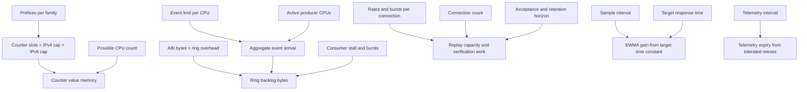

# Рев’ю числових контрактів і математичних підстав Sokol-Core

**Дата:** 2026-09-28. **Snapshot:** `aeaf88bdbcb105c199347254a1a55e4cf25e56bc`.
**Статус:** незалежний аналіз і рекомендований план; production-код не змінено.
Основний об’єкт — поточний Core, а не повторне рев’ю сусідніх прототипів.

## Висновок

Проблема не в самій наявності чисел. Проблема — непозначені **одиниці, область дії,
передумови й залежності**. Частину значень уже добре визначено: спільний ABI, capacity
карт, бюджет кадру, ADR-0013 із виміряною ціною криптографії. Але локальні бюджети ще
не утворюють повної моделі ресурсів вузла.

Найважливіші результати:

1. ATP gate у поточному main loop недосяжний як обмежувач: одна витрата 250 після
   кожного reset бюджету 10 000 000.
2. Per-connection rate limits, global replay-cache та per-CPU events потребують
   **спільних capacity equations**, а не незалежного підбору констант.
3. `500.0` у SokolEngine — поріг швидкості пакетів, не зміни швидкості й не статистична
   аномалія; `RelaxationSec` не має часової одиниці без sample period.
4. Треба централізувати однакові **контракти**, але не об’єднувати випадково однакові
   числа. Особливо не виводити bounded history з capacity kernel map без окремої причини.
5. Справжні наукові опори тут є: token bucket/network calculus, Little, EWMA,
   Shannon, anti-entropy. Жодна з них автоматично не обґрунтовує defaults 64, 500,
   0.5, 900 чи 65 536.

Нові ABI/replay/clock changes уже присутні у snapshot (ADR-0015–0017); цей звіт не
повторює старі рекомендації так, ніби їх ще не реалізовано.

## Метод і межі

Прочитані paths: `common/src`, `ai/src`, числові policy/resource/transport місця
`orchestrator/src`, XDP parser/maps/events, поточні ADR та лабораторні обмеження.
[Інвентар](evidence/numeric-inventory.csv) містить **288 лексичних кандидатів**:
const, CLI defaults і Duration literals. Це не 288 дефектів і не повний AST-аналіз.
Мітка `after-first-cfg-test` — допоміжна, не доказ runtime reachability.

[Probes](evidence/reproduce.py) компілюють точні ізольовані фрагменти snapshot:
ATP, SokolEngine, ReplayGuard. **5 нових діагностичних перевірок + 2 наявні тести пройшли**;
зелений probe означає відтворення описаної поведінки. [Результат](evidence/probes.json).
Не виконувалися Linux smoke, NIC benchmark, повний test suite чи навантажувальний
mesh-тест. Розрахунки нижче — аналітичні bounds/оцінки з явними припущеннями.

## 1. Знахідки за пріоритетом

### N01 — P1: ATP створює хибне враження обмеження роботи

Місця: `main.rs:1271,2330,2404`,
`common/src/atp.rs:4,35`. Owner: maintainer main loop.

Ліміт 10 000 000, charge 250, один charge на tick; кожний tick починається з reset.
Отже, для цього шляху `used=250 < limit` завжди. Глобальна стеля 100 000 000 тут
нічого не змінює. Перевірка 1000 циклів відтворює незмінний залишок 9 999 750.
Це не доказ, що весь Core необмежений: інші незалежні limits працюють.

**Зміна:** або прибрати цей gate з production-обіцянок як неактивний експеримент,
або визначити одиницю work credit, тариф кожної реально повторюваної роботи й
резерв для maintenance. Не називати credits джоулями чи CPU cycles без вимірювань.
**Gate:** збільшення кількості робіт мусить вичерпувати бюджет; mutant, що ігнорує
результат списання, мусить ламати тест. Просте перейменування 250 на COST не допоможе.

### N02 — P1: replay capacity не узгоджена з admission envelope

Місця: `p2p.rs:55–72,548–577,896`. ReplayGuard спільний для registry; buckets
створюються на connection. Місткість — 100 000 nonce pairs. Після 50 000 записів
кожний `check_and_record` обходить HashMap через retain під спільним mutex.
Заповнення відмовляє новим кадрам, без витіснення replay evidence: це fail-closed,
але availability і CPU cost залежать від сумарного потоку всіх connections.

Acceptance: `|timestamp-now| ≤ 30 s`. GC лишає `timestamp ≥ now-60 s`.
Запис зі звичайним timestamp зберігається приблизно 60 s під тиском GC; максимально
майбутній допустимий timestamp — до 90 s від приймання. GC консервативніший за
acceptance. Probe: заповнений cache із timestamp 0 відмовляє fresh pair при
now=30.001 s, хоча старі frames уже stale; при 60.001 s звільняється.
Це ізольований тест guard, не готовий мережевий exploit.

Для нормальних timestamps проста capacity-оцінка при frame rate 500/s:
`C ≥ Σ_connections (burst_i + rate_i × retention)`.
Вже 4 connections дають `4×(5000+500×60)=140 000 > 100 000`.
Це допустима верхня огинаюча за frame budget, не твердження про фактичний sustained
traffic чи можливості CPU. Byte budget і час verification теж обмежують потік.

**Зміна:** явно узгодити supported peer/connection count, global verification budget,
retention і cache capacity; amortized expiry через time buckets/queue замість
O(cache_size) на кадр. При wall-clock jumps зберегти чітку replay-семантику.
**Gate:** multi-peer mixed-size load до обраної межі; memory, mutex hold time,
verification CPU, cache-full rejection; жодного прийнятого повтору в acceptance window.

### N03 — P1 для capacity planning: per-CPU числа множаться на машину

Місця: `common/src/lib.rs:47–53,95`; `ebpf/src/main.rs:111–139,179–190`.

- `BLOCK_HIT_SLOTS = 2 × 65 536`; `u64` per possible CPU:
  **1 MiB × possible CPUs** тільки на values BLOCK_HITS, без map overhead.
  64 possible CPU → 64 MiB; 256 → 256 MiB. Idle CPU не означає відсутність allocation.
- Events: 64/s **на CPU**, а не на node. За P активних producers sustained upper rate
  — `64P events/s`, payload — `19 200P bytes/s` для 300-byte DropEvent.
- Shared ring — 256 KiB. Якщо врахувати 8-byte kernel record header та 8-byte alignment,
  record займає 312 B; ідеальна місткість приблизно 840 records, фактична доступна
  місткість може бути меншою. За P=64 це близько 0.205 s sustained output без consumer.
- Лічильник скидається у вікнах: біля межі можна отримати два bursts по 64 на CPU.
  Це не sliding-window гарантія «не більше 64 у будь-яку секунду».

Kernel ringbuf має bounded reservation і power-of-two capacity; це вимога структури,
а не обґрунтування саме 256 KiB. [Linux BPF ringbuf](https://docs.kernel.org/bpf/ringbuf.html).

**Зміна:** startup resource estimate + supported CPU profile; навести budget для
consumer stalls і aligned event bytes. Якщо потрібний node-wide rate — спроєктувати
його окремо, не вдавати, що per-CPU cap уже ним є.
**Gate:** producer saturation, stall/resume, suppressed та reservation-failure visibility,
memory footprint на supported CPU topology. Це capacity risk, не доказ memory leak.

### N04 — P2: поріг rate названо anomaly; units у математичних helpers неповні

Місця: `main.rs:2161,2534–2567`, `sokol.rs:33–70`, `ai/src/inference.rs:80–140`.

`detect_anomaly` отримує накопичений packet counter, тому
`(current-prev)/dt` має одиницю **packets/s**, а epsilon=500 — rate threshold.
Постійні 600 pps дають anomaly кожний tick, навіть без сплеску. Це відтворено.
Якщо потрібен acceleration/spike, треба різниця rates (packets/s²), або baseline
модель; інакше чесно назвати `rate_exceeds_threshold`, параметризувати поріг і
вказати, що цей шлях логування не доводить DDoS. Він окремий від 1000 drops/s,
які живлять under_attack telemetry.

`compute_relaxation_time(alpha)=-1/ln(alpha)` коректний для **retention factor**
за один sample. У EWMA mean alpha — **new-sample gain**, retention дорівнює `1-alpha`.
Для нього `τ_seconds=-Δt/ln(1-alpha)`; half-life `h=-Δt ln(2)/ln(1-alpha)`.
При gain 0.1 та Δt=1 s: τ≈9.491 s, тоді як helper(0.1)≈0.434.
Тест alpha=0.5 маскує різницю, бо alpha=1-alpha. Helper зараз не має production caller;
це контрактний ризик майбутньої інтеграції, не активний дефект детектора.

Entropy helper реалізує `-Σp log₂p`, але приймає `[2]` і повертає -2; невірні значення
просто пропускаються. Для Shannon entropy потрібна нормована probability mass
`p_i≥0`, `Σp_i=1`; log base 2 задає bits. Нормалізація histogram counts і валідація
probabilities — різні API. Helper також не використовується в поточному main loop.

EWMA alpha constructor не перевіряє `0<alpha≤1`; variance seed 1.0 має одиницю x²,
а floor stddev 1e-6 — одиницю x. Це не універсальні безрозмірні epsilons. `N=0`
дає ділення на нуль у mean score. У поточному production loop EWMA не підключений.
Його variance — EWMA squared innovation від попереднього mean, не автоматично
незміщена population variance чи NIST control-chart statistic.

**Зміна:** розвести Gain/Retention, додати Δt, units та input-domain tests; окремо
зафіксувати призначення live rate threshold. Не оголошувати середній absolute z-score
ймовірністю атаки або «3σ гарантією».

### N05 — P2: однакові capacity без спільної семантики

Місця: `block_table.rs:27–37,672–709,237`.
`MAX_EVENTS` і `MAX_STRIKES` виведені з kernel `BLOCKLIST_CAPACITY`.
Але одна активна ціль може породити багато event IDs, і кількість historical targets
не тотожна кількості enforced prefixes. Зміна місткості XDP мимоволі змінює
retention/deduplication workload та persisted state.

Для count-bounded history ефективний горизонт приблизно
`T_effective ≤ min(T_age, C/λ_unique)` при стаціонарному потоці різних IDs.
65 536 / 2000 = **32.768 s** без початкового burst; це не 24 h.
За 4 unique IDs/s — приблизно 4.55 h. Обробка, duplicates і burst змінюють фактичний час.
Однакові `EVENT_MEMORY=STRIKE_MEMORY=24 h` самі по собі не гарантують replay protection
на весь горизонт: count eviction може забути event, поки strike цілі ще існує.

**Зміна:** окремі семантичні limits/history budgets; constraint
`dedup horizon ≥ strike horizon` лише якщо справді забезпечений capacity або durable
index. Інакше документувати bounded best effort та поведінку після eviction.
`MAX_KNOWN_CLAIMS=4×capacity` теж є memory-policy choice, не теоремою.
**Gate:** old event після eviction, active target із багатьма events, full map без
history pressure і навпаки; зафіксувати очікувану escalation-семантику.

### N06 — P2: operation count не є часовим бюджетом

`flowspec.rs:21–25,101,224–248`: 64 зміни на round, кожний CLI call до 5 s,
перед ними читання двох RIB families. Повільні успішні виклики можуть дати round
майже `(2+64)×5=330 s`; error може перервати його раніше. Interval 1 s не робить
це 64 ops/s. Shutdown budget 10 s — deadline спроби cleanup, не гарантія відкликати
довільну кількість правил. Worker окремий, тому це не 330 s блокування main tick.

**Зміна:** назвати `MAX_OPS_PER_ROUND`; виміряти latency distribution, cancellation
і backlog age; час round обмежувати окремо за operational requirement.
Не виводити shutdown budget механічно як 2×call timeout: кількість calls не стала.

## 2. Що означають головні числа

Класи: **S** specification/representation; **D** derived; **M** measured/calibrated;
**P** policy; **H** heuristic; **T** independent test oracle. M потребує evidence
для конкретного platform/profile; наявність формули не робить input виміряним.

| Параметр / місце | Клас, одиниця | Походження / дія |
|---|---|---|
| EtherTypes, protocol IDs, TCP bits; `ebpf:17–34` | S, wire tags | Standards, не tuning; TCP flags уже є у common, прибрати дубль SYN/ACK |
| IPv4/IPv6 widths 32/128; mapped prefix 96 | S/D, bits | Формат адреси; не пов’язувати з cache capacity чи hash length |
| IPv6 `(ext_len+1)×8`, fragment size 8 | S, bytes | RFC layout; число 8 тут не «вісім спроб» |
| IPv6 parse iterations 4; VLAN iterations 2 | P, work bound | Named support limits; RFC не обмежує загальну IPv6 chain саме чотирма |
| MAX_PAYLOAD 256 | P, captured bytes | Packet sample budget; не той самий MAX_PAYLOAD audit 64 KiB |
| DropEvent 300 / PacketStats 208 | S/T, ABI bytes | Frozen assertions ADR-0015; не замінювати oracle на `size_of` того самого типу |
| BLOCKLIST_CAPACITY 65 536 | P, prefixes/family | Resource envelope, не вимога LPM бути power of two |
| BLOCK_HIT_SLOTS 2×capacity | D, counter slots | По слоту на запис кожної з двох family maps; обґрунтоване спільне джерело |
| MAX_EVENTS_PER_CPU_PER_SEC 64 | P/M, events/(CPU·s) | Потрібна consumer/CPU модель; не спільний параметр із flowspec 64 |
| EVENTS 256 KiB | P з S-constraint, bytes | Power-of-two обов’язкове, magnitude визначається burst/stall budget |
| MAX_FRAME_BYTES 128 KiB | P/protocol cap, bytes | Denial-of-service і memory boundary; не MTU і не Ethernet frame limit |
| SNAPSHOT_PAYLOAD_BUDGET 112 KiB | P/D, JSON bytes | 16 KiB запас наразі евристичний; надалі вивести з exact wrapper/signature/slack |
| Header 32, signature 3309 | S/D, bytes | Header=3+1+8+8+8+4; signature від ML-DSA-65 API/FIPS 204 |
| LEGACY_KEY_FILE_LEN 1952+4000 | S, legacy bytes | Заморожений старий format; не переприв’язувати до сучасного secret-key size |
| Frames 500/s, burst 5000 | M/P | Burst/rate=10 s; ADR-0013 обґрунтовує steady cost, не весь node aggregate |
| Bytes 4 MiB/s, burst 32 MiB | M/P | Burst/rate=8 s; **не** 10 s, як frame bucket |
| IPC 1000/s+5000; global 2000/s+20000 | M/P | Burst horizons 5 s та 10 s; backpressure, не обіцянка миттєвої доставки |
| Control 50/s+500 | P | 10 s burst; семантика відмінна від mesh rate |
| Urgent queue 256, bulk 64 | P, envelopes/peer | Arrival/service/burst model; strict priority не гарантує bulk progress |
| 16 pending handshakes; 2/address; 5 s | P | Bounds exposure; ~3.2 slots/s turnover при постійному заповненні й timeout, не throughput auth |
| Telemetry 5 s; TTL=3×interval | P→D | Три report periods; коефіцієнт 3 — loss/jitter policy, не універсальний закон |
| Heartbeat 10 s; idle 30 s | P→D candidate | Інший failure detector; явний missed-period count, не clock-skew coupling |
| Digest 15 s; snapshot cooldown 5 s | P | Recovery overhead tradeoff; 15 збігається з telemetry TTL випадково |
| Clock skew 30 s; clock-step alert 5 s | P | Перше acceptance window, друге observability; не alias storm hold чи handshake |
| Storm threshold 0.5; hold 30 s | P | Strict majority of observed live nodes + temporal debounce; не Byzantine consensus |
| Attack threshold 1000 drops/s | P/M | Baseline і tolerated false alarms; не IPC lines/s, попри однакове 1000 |
| TTL base 900 s, max 86400 s | P | Risk/utility choice; exponential escalation як policy, не TCP backoff theorem |
| Claim coalescing lifetime/4 | H/P | Обмеження частоти нових claims; окрема tuning dimension |
| Quorum k=2; wide /24,/64 | P | Дві issuer identities для широкого prefix; не незалежність джерел і не BFT |
| min-block /16,/48 | P | Межа дозволеного охоплення; окрема від wide-prefix quorum |
| peer_max_active 16384 | P | Per-issuer authority budget; 1/4 capacity — можливе пояснення, не встановлений інваріант |
| Watermark 0.8 | H/P | 20% headroom; виводити з arrival rate × reaction time, не «правила 80/20» |
| State wait 2 s, stale 5 s, retry 1 s | P | Request deadline, health deadline, retry schedule — окремі meanings |
| Audit queue 10000, batch 64, sync 100 ms | P/M | Memory/backlog та loss window; batch/interval не гарантує 640 records/s |
| Audit rotate 100 MiB, keep 10 | P | Disk budget; active segment, record overshoot і current retention пояснити окремо |
| 2222 admin; 44333 probe; service ports | P або protocol convention | Admin exception дублюється cross-binary; не фізична константа |

Для чисел legacy/wire необхідні незалежні golden bytes. Для operational defaults
потрібні workload evidence й причина перегляду. Для test fixture числа можуть бути
навмисно іншими, щоб тест перевіряв загальність, а не лише default.

## 3. Карта залежностей: що справді з чого виводиться



Немає причинної стрілки `blocklist capacity → event history capacity`, доки не
задано workload model. Немає стрілки `handshake 5 s → snapshot cooldown 5 s`.

Корисні рівняння для перевірок:

- TTL escalation: `TTL(s)=min(Tmax,Tbase×2^(s−1))`; zero base окремо означає permanent.
  Defaults дають 900,1800,3600,7200,14400,28800,57600,86400: cap на 8-му strike.
- Full mesh має `n(n−1)/2` пар; broadcasts від усіх nodes дають O(n²) aggregate work.
  Per-peer budget треба множити на fanout; signatures/serialization можуть мати іншу
  область кешування, тому не множити всі витрати механічно однаково.
- Envelope: `encoded_len = header + payload + signature`; length prefix 4 B зовні.
  Поточний cap body 131072, snapshot JSON target 114688, header 32, signature 3309:
  залишок 13043 B **до додаткового wrapper accounting**. Остаточна перевірка — exact
  encoded frame ≤ cap, а не лише арифметика констант.
- CPU work budget: `Σ_i λ_i × c_i ≤ U_target × available_CPU_seconds_per_second`.
  `c_i` — виміряна або консервативна ціна конкретної операції; means не є WCET.
- Warning headroom: `free_slots ≥ burst_new_targets + rate_new_targets×reaction_time`
  плюс запас. Звідси можна отримати watermark, якщо inputs справді відомі.

## 4. Дедуплікація оголошень: правила, а не загальний constants.rs

**Об’єднати за одним контрактом:**

- `ADMIN_SSH_PORT` між XDP і trident trap: спільна safety policy й cross-component test.
  Якщо це deployment config — owner/config generation, не приховані різні defaults.
- SYN/ACK aliases із `ebpf` — використати `common::tcp_flags` (або один protocol owner).
- Mesh header/signature/body cap/snapshot budget — один transport accounting API.
  Cryptographic sizes брати з pinned library type/standard; історичні formats незалежні.
- Frame/telemetry lifecycle — named durations і explicit missed-period relation там,
  де рішення справді звучить «витримуємо N пропусків».

**Розділити навіть за рівних значень:**

- `64`: kernel event rate, bulk queue length, flowspec batch, audit batch, IPv6 prefix.
- `256`: packet sample bytes, urgent envelopes, block retries, trap concurrency.
- `32`: digest bytes, IPv4 bits, envelope header bytes, MiB burst multiplier.
- `5 s`: handshake, frame I/O, snapshot cooldown, telemetry, state stale, clock alert.
- `1000`: IPC lines/s, attack drops/s, channel elements, ms/s conversion.
- `24 h`: strike memory, dedup age, maximum block lifetime — можна зв’язати constraint,
  але вони не є одним поняттям. Зміна одного не повинна неявно змінювати всі.

**Зберегти незалежне дублювання у перевірках:** frozen ABI size/offset, protocol
vectors, історичні signed bytes. `assert_eq!(size_of::<T>(), size_of::<T>())` та
expected, обчислений тією самою production-функцією, перестають бути oracle.
Наявний ADR-0015 тут є правильним напрямом.

## 5. Наукові опори: що можна чесно назвати

Це карта відповідностей, не твердження про первісний намір авторів.

| Опора | Зв’язок із Core | Що не випливає |
|---|---|---|
| Token bucket; RFC 3290 Appendix A | `Bucket`: rate, burst, pacing/debt; envelope `A(t)-A(s)≤b+r(t-s)` на відповідному shaped потоці | Обрані rates не доведені без ціни operations; bucket не гарантує downstream service |
| Le Boudec–Thiran network calculus | Arrival/service curves дають backlog/delay bounds для queues | Немає deterministic latency гарантії без lower service bound і обліку пріоритетів |
| Little, `L=λW` | Перевірка узгодженості середніх queue length, throughput, residence time | Mean identity не визначає maximum queue, p99 чи burst capacity |
| EWMA / Roberts, NIST handbook | Exponential smoothing; gain ↔ response time | Поточний innovation score не є автоматично control chart із calibrated false-positive rate |
| Shannon entropy | `compute_shannon_entropy` після валідації probability distribution | Інформаційна entropy не дорівнює термодинамічній entropy або attack probability |
| Demers et al., anti-entropy | Digest→request→snapshot та repair після втрат | Тут немає автоматично epidemic dissemination по довільному graph: claims не relayed |
| Temporal hysteresis/debounce | `StormLatch`: затримка виходу після безперервного calm | Це не два amplitude thresholds Schmitt trigger і не proof of control stability |
| Geometric escalation | TTL doubling, bounded reconnect backoff | Це policy family, не запозичена TCP congestion-control гарантія |

Для network calculus при arrival `α(t)=b+rt`, service `β(t)=R·max(0,t−T)`, `R≥r`:
backlog bound `b+rT`, delay bound `T+b/R` у відповідній deterministic model.
Для eventual drain із запасом практично потрібне `R>r`. Це **пропонований спосіб
обґрунтування**, а не вже доведена service curve Sokol. Strict priority може не
залишити bulk жодного positive service rate. Джерело: Le Boudec–Thiran, §1.4.1,
backlog/delay bounds. [Книга авторів](https://leboudec.github.io/netcal/latex/netCalBook.pdf).

Проєктне `quorum=2` означає support threshold, а не Byzantine agreement. Немає
підстав автоматично приписувати `3f+1`, Paxos/Raft, CAP classification чи CRDT theorem
до того, як визначені model, fault assumptions, membership, merge/expiry і claim.
Підписані дві identities можуть належати одному оператору або залежати від того самого
детектора. [Lamport–Shostak–Pease, 1982](https://www.microsoft.com/en-us/research/publication/byzantine-generals-problem/)
описує іншу, формально задану задачу agreement.

Джерела перевірені 2026-09-28; переказ, без великих цитат:

- [RFC 3290, Appendix A](https://www.rfc-editor.org/rfc/rfc3290.html#appendix-A): token/leaky bucket semantics.
- [Little, 1961 — оригінальна стаття](https://pubsonline.informs.org/doi/10.1287/opre.9.3.383): queueing identity.
- [NIST EWMA handbook](https://www.itl.nist.gov/div898/handbook/pmc/section3/pmc324.htm): статистика та припущення control chart.
- [Shannon, 1948 — Bell Labs](https://www.nokia.com/bell-labs/publications-and-media/publications/a-mathematical-theory-of-communication/): information entropy.
- [Demers et al., 1987 — paper](https://www.cis.upenn.edu/~bcpierce/courses/dd/papers/demers-epidemic.pdf): direct mail, anti-entropy, epidemic algorithms.
- [FIPS 204](https://csrc.nist.gov/pubs/fips/204/final): ML-DSA parameter sets; не джерело legacy Dilithium serialization.
- [RFC 9293](https://www.rfc-editor.org/rfc/rfc9293.html): TCP field semantics.

## 6. Формат знань, який зменшить навантаження на LLM

Не дублювати всі values у ще одному ручному YAML. Достатньо одного stable ID на
семантичний параметр і metadata поруч із owner; value залишається в коді/config,
а таблиця документації генерується. Приклад **пропонованого**, не впровадженого контракту:

```yaml
id: mesh.frame_rate
owner: orchestrator/src/p2p.rs::FRAMES_PER_SEC
unit: frames/second
scope: authenticated_connection
kind: measured_policy
basis: docs/adr/0013-resource-limits.md
coupled_to: [mesh.frame_burst, mesh.replay_capacity, mesh.connection_count]
assumptions: [bounded_frame_bytes, measured_verification_cost]
claim: pacing_only
non_claims: [node_global_cpu_bound, guaranteed_delivery_latency]
review_trigger: [crypto_upgrade, peer_count_change, hardware_change]
```

Для математичного поняття: `concept_id`, canonical term, equation, units, assumptions,
code owner, source, executable witness, explicit non-claims. Наприклад
`stats.ewma` описує gain і retention **один раз**, а callers посилаються на нього.
Bio-назва може бути alias: `metabolism → resource accounting`, але не підміняє
контракт. Посилання на науковця корисне лише разом із boundary applicability.

## 7. Рекомендований порядок змін

1. **N01, N02 першими:** прибрати помилкову ATP-обіцянку / зробити бюджет дієвим;
   узгодити cache/rate/connection envelope й прибрати per-frame full scan.
2. **Resource profile:** startup estimate для possible CPUs, event throughput,
   ring backlog і history retention. Окремо budget peer aggregate CPU/bytes.
3. **Semantic cleanup без зміни policy:** named units/scopes, спільні TCP/admin
   definitions, MAX_OPS_PER_ROUND, підписані transport size equations.
4. **Math API:** rate threshold naming; Gain/Retention/Δt, probability validation,
   finite/domain checks. Тести alpha=0.1/0.9, Δt≠1, empty/invalid distributions.
5. **Knowledge contract:** короткий NUMERICAL-CONTRACTS document/ADR із картою понять,
   sources та generation із owner values; CI перевіряє зв’язки, не «відсутність цифр».
6. **Calibration на цільовому deployment:** bursts, peer counts, CPU topology,
   consumer stalls, TTL utility/false positives. Не тюнити constants під один lab result.

Приймання: незалежний reviewer може для кожного критичного числа відповісти
«яка одиниця, хто обирає, що зміниться при ×2, який тест впаде, яке припущення потрібне».
Зменшення кількості literals саме по собі не є критерієм якості.

## Навігація до перевіреного коду

- [ATP budget: orchestrator/src/main.rs:1271](https://github.com/ValkyrieSentinel/sokol-core/blob/aeaf88bdbcb105c199347254a1a55e4cf25e56bc/orchestrator/src/main.rs#L1271).
- [reset перед charge: orchestrator/src/main.rs:2330](https://github.com/ValkyrieSentinel/sokol-core/blob/aeaf88bdbcb105c199347254a1a55e4cf25e56bc/orchestrator/src/main.rs#L2330).
- [вимірювання rate: orchestrator/src/main.rs:2539](https://github.com/ValkyrieSentinel/sokol-core/blob/aeaf88bdbcb105c199347254a1a55e4cf25e56bc/orchestrator/src/main.rs#L2539).
- [transport limits: orchestrator/src/p2p.rs:55](https://github.com/ValkyrieSentinel/sokol-core/blob/aeaf88bdbcb105c199347254a1a55e4cf25e56bc/orchestrator/src/p2p.rs#L55).
- [ReplayGuard: orchestrator/src/p2p.rs:548](https://github.com/ValkyrieSentinel/sokol-core/blob/aeaf88bdbcb105c199347254a1a55e4cf25e56bc/orchestrator/src/p2p.rs#L548).
- [retention та capacity: orchestrator/src/block_table.rs:27](https://github.com/ValkyrieSentinel/sokol-core/blob/aeaf88bdbcb105c199347254a1a55e4cf25e56bc/orchestrator/src/block_table.rs#L27).
- [math helpers: orchestrator/src/sokol.rs:33](https://github.com/ValkyrieSentinel/sokol-core/blob/aeaf88bdbcb105c199347254a1a55e4cf25e56bc/orchestrator/src/sokol.rs#L33).
- [EWMA: ai/src/inference.rs:80](https://github.com/ValkyrieSentinel/sokol-core/blob/aeaf88bdbcb105c199347254a1a55e4cf25e56bc/ai/src/inference.rs#L80).
- [shared map/event limits: common/src/lib.rs:47](https://github.com/ValkyrieSentinel/sokol-core/blob/aeaf88bdbcb105c199347254a1a55e4cf25e56bc/common/src/lib.rs#L47).
- [ringbuf: ebpf/src/main.rs:139](https://github.com/ValkyrieSentinel/sokol-core/blob/aeaf88bdbcb105c199347254a1a55e4cf25e56bc/ebpf/src/main.rs#L139).
- [round і call budgets: orchestrator/src/flowspec.rs:21](https://github.com/ValkyrieSentinel/sokol-core/blob/aeaf88bdbcb105c199347254a1a55e4cf25e56bc/orchestrator/src/flowspec.rs#L21).
- [storm latch: orchestrator/src/cluster_state.rs:87](https://github.com/ValkyrieSentinel/sokol-core/blob/aeaf88bdbcb105c199347254a1a55e4cf25e56bc/orchestrator/src/cluster_state.rs#L87).
